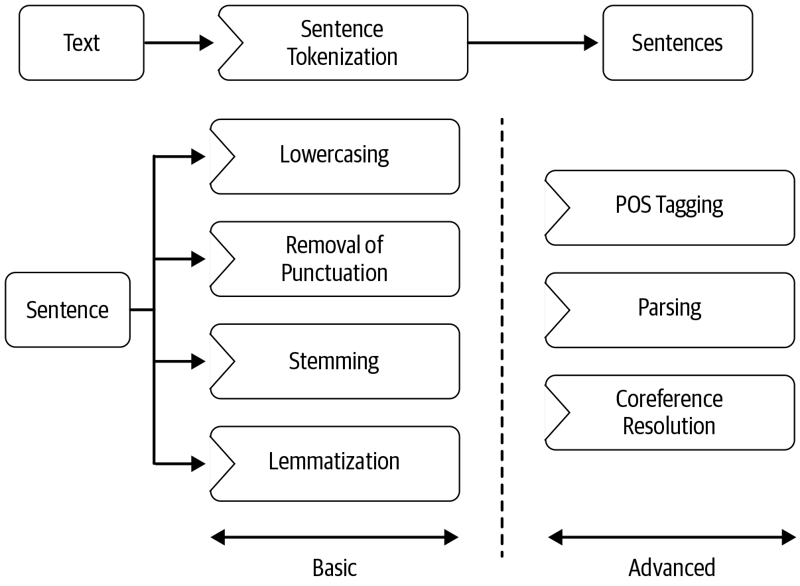

- [Data acquisition](#data-acquisition)
  - [Use a puplic dataset](#use-a-puplic-dataset)
  - [Scrap data](#scrap-data)
  - [Product intervention](#product-intervention)
  - [Data augmentation](#data-augmentation)
    - [Basic techniques](#basic-techniques)
    - [Advanced techniques](#advanced-techniques)
- [Text-extraction and cleanup](#text-extraction-and-cleanup)
  - [HTML parsing and cleanup](#html-parsing-and-cleanup)
  - [Unicode normalization](#unicode-normalization)
  - [Spelling correction](#spelling-correction)
  - [System-specific error correction](#system-specific-error-correction)
- [Pre-processing](#pre-processing)
- [Feature engineering](#feature-engineering)
- [Modeling](#modeling)
  - [Start with simple heuristics](#start-with-simple-heuristics)
  - [Building your model](#building-your-model)
  - [Building  THE Model](#building--the-model)
- [Evaluation](#evaluation)
  - [Intrinsic Evaluaiton](#intrinsic-evaluaiton)
  - [Extrinsic Evalutaion](#extrinsic-evalutaion)
- [Post-modeling phases](#post-modeling-phases)
  - [Deployment](#deployment)
  - [Monitoring](#monitoring)
  - [Model updating](#model-updating)
- [Reference](#reference)
# Data acquisition
## Use a puplic dataset 
Sources for public dataset: Kaggle, paperwithcode, ... 
## Scrap data 
## Product intervention
Work with your company's product team to add features to products in order to collect as much user's data as possible from as many users as possible. 
## Data augmentation
Data aumentation techniques are tricks that create more data from original data.
### Basic techniques 
**Synonym replacement** 

Replace k random words with their synynom using *Synsets* in *Wordnet*

**Adding noise to data** 

In many NLP applications, incomming data (test/infer data) can contain noise. So we should add noise to training data to reduce overfiting.

The source of noise data and reasons for it: 

- Spelling mistakes due to the characteristics of platforms where we get data (for example, twitter) $\to$ add noise to training data by alternating a random word with  another word that is closer in spelling. 
- Spelling mistakes due to 'fat finger' problem on mobile keyboards $\to$ Simulate a QWERTY keyboard error by replacing a few characters with their neighboring characters on the QWERTY keyboard

**Back Translation** 

For example, we have an enlish sentence *S1*. Then we get sentence *S2* by translating *S1* to another language like german using google translate. Then we translate *S2* back to english and get sentence *S3*. 

We'll find that *S1* and *S3* are very similar in meaning but are slightly variations of each other. Now we can add *S3* to our dataset.

**TF-IDF based word replacement** 

Using back translation can lose some crucial words and TF-IDF can handle this issue.

**Biagram flipping**

Divide sentence into biagrams. Take one random biagram and flip it. For example, "I'm going to the supermarket", then "going to" $\to$ "to going".

**Entities replacement**

Replace entities like company name, person, country ,... with other entities in the same category.

### Advanced techniques 
List of notable tools/packages for data augmentation.

**[Snorkel](https://www.snorkel.org/)**

This is a system for building training data automatically, without manual labeling. Using Snorkel, a large training dataset can be “created”—without manual labeling—using heuristics and creating synthetic data by transforming existing data and creating new data samples.

**[Easy data augmentation](https://github.com/jasonwei20/eda_nlp) and [NLPAug](https://github.com/makcedward/nlpaug)**

These two libraries are used to create synthetic samples for NLP. They provide implementation of various data augmentation techniques, including some techniques that we discussed previously

**Active listening** 

This is a specialized paradigm of ML where the learning algorithm can interactively query a data point and get its label. It is used in scenarios where there is an abundance of unlabeled data but manually labeling is expensive.
In such cases, the question becomes: for which data points should we ask for labels to maximize learning while keeping the labeling cost low?
# Text-extraction and cleanup
Text-extraction and cleanup refer to the process of extracting raw data from input datas (PDF invoice, HTML text, text embedded in images, ...) by removing non-textual information such as HTML tag, metadata, ... and converting the text to the required encoding format. 
## HTML parsing and cleanup
## Unicode normalization 
Deal with symbols, emojis, and other graphic characters.
## Spelling correction 
Sources of spelling mistakes:

- Shorthand typing: *Hllo* world, I am back! 
- Fat finger problem: I *pronise* that I will not *bresk* the silence again  

Solutions: 

- Use available API: [Microsoft API](https://docs.microsoft.com/en-us/azure/cognitive-services/bing-spell-check/quickstarts/python) 
-  Build your own spelling checker using a huge dictionary of words from a specific language.
## System-specific error correction 
Sometimes, we scrap data from special source such as PDF, scanned document using specific package such as pyPDF, Tesseract (OCR). These package are far from perfect and hence, scrapted texts are prone to error.
# Pre-processing
**Tokenizer** 

Tokenizers of some packages like NLTK, SpaCy are not perfect, especially in some uncommon domains. So you need to verify tokenizer's result carefully.

**Stemming and lemmatization** 

stemming is commonly used in search engines to
match user queries to relevant documents and in text classification to reduce the feature space to train machine learning models

**Language detection** 

Sometimes, in some datasets such as review datasets, Sentences are in diffrent languages or a single sentence contains different languages. We can use libraries like [Polygot](https://polyglot.readthedocs.io/en/latest/) for language detection.

**Parsing and Coreference resolution** 

Refers to relation extraction or the relationship betweenn entities

# Feature engineering
Thegoal of feature engineering is to capture the characteristics of the text into a numeric vector that can be understood by the ML algorithms
# Modeling 
## Start with simple heuristics
In the begining, when you have little data, Using simple rule-based may be a good option. 

Even when we’re building ML-based models, we can use such heuristics to handle special cases—for example, cases where the model has failed to learn well.

We can use *regex*, *spaCy's matching* for capturing heuristics,

## Building your model 
When we have more data or rule-based systems become complex and hard to maintain, we can consider building models.

At this point, we can incorporate heuristics into models by using it as features or applying it before feeding the data in models. For instance, if for certain words in an email, there’s a 99% chance that it’s spam, then it’s best to classify that email as spam instead of sending it to an ML model.
## Building  THE Model
Methods to improve model's performance
- **Ensemble and stacking** 
- **Better feature engineering** 
- **Transfer learning** 
- **Reapplying heuristics**: No ML model is perfect. Hence, ML models still make mistakes. It’s possible to revisit these cases again at the end of the modeling pipeline to find any common pattern in errors and use heuristics to correct them. We can also apply domain-specific knowledge that is not automatically captured in the data to refine the
model predictions
# Evaluation 
Sucessing in this phase depends on using the right metrics. And choosing the metrics depends on the phase. In model buiding and deployment phase, we use ML metrics (*Intrinsic metrics*) and in production phase, we use business metrics (*extrinsic metrics*)

## Intrinsic Evaluaiton 
| Metric | Description | Applications |
| --- | --- | --- |
| Accuracy | Used when the output variable is categorical or discrete. It denotes the fraction of times the model makes correct predictions as compared to the total predictions it makes | Mainly used in classification tasks, such as sentiment classification (multiclass), natural language inference (binary), paraphrase detection (binary), etc. |
| Precision | Shows how precise or exact the model’s predictions are,i.e., given all the positive (the class we care about) cases, how many can the model classify correctly? | Used in various classification tasks, especially in cases where mistakes in a positive class are more costly than mistakes in a negative class, e.g., disease predictions in healthcare. |
| Recall | Recall is complementary to precision. It captures how well the model can recall positive class, i.e., given all the positive predictions it makes, how many of them are indeed positive? | Used in classification tasks, especially where retrieving positive results is more important, e.g., e-commerce search and other information-retrieval tasks. |
| F1 score | Combines precision and recall to give a single metric, which also captures the trade-off between precision and recall, i.e., completeness and exactness. F1 is defined as (2 × Precision × Recall) / (Precision +Recall). | Used simultaneously with accuracy in most of the classification tasks. It is also used in sequence-labeling tasks, such as entity extraction, retrieval-based questions answering, etc. |
| AUC | Captures the count of positive predictions that are correct versus the count of positive predictions that are incorrect as we vary the threshold for prediction. | Used to measure the quality of a model independent of the prediction threshold. It is used to find the optimal prediction threshold for a classification task. |
| MRR (mean reciprocal rank) | Used to evaluate the responses retrieved given their probability of correctness. It is the mean of the reciprocal of the ranks of the retrieved results. | Used heavily in all information-retrieval tasks, including article search, e-commerce search, etc. | 
| MAP (mean average precision) | Used in ranked retrieval results, like MRR. It calculates the mean precision across each retrieved result | Used in information-retrieval tasks. | 
| RMSE (root mean squared error) | Captures a model’s performance in a real-value prediction task. Calculates the square root of the mean of the squared errors for each data point. | Used in conjunction with MAPE in the case of regression problems, from temperature prediction to stock market price prediction. |
| MAPE (mean absolute percentage error) | Used when the output variable is a continuous variable. It is the average of absolute percentage error for each data point. | Used to test the performance of a regression model. It is often used in conjunction with RMSE. |
| BLEU (bilingual evaluation understudy) | Captures the amount of n-gram overlap between the output sentence and the reference ground truth sentence. It has many variants. | Mainly used in machine-translation tasks. Recently adapted to other text-generation tasks, such as paraphrase generation and text summarization. |
| METEOR | A precision-based metric to measure the quality of text generated. It fixes some of the drawbacks of BLEU, such as exact word matching while calculating precision. METEOR allows synonyms and stemmed words to be matched with the reference word. | Mainly used in machine translation. | 
| ROUGE | Another metric to compare quality of generated text with respect to a reference text. As opposed to BLEU, it measures recall. | Since it measures recall, it’s mainly used for summarization tasks where it’s important to evaluate how many words a model can recall. | 
| Perplexity | A probabilistic measure that captures how confused an NLP model is. It’s derived from the cross-entropy in a next word prediction task | Used to evaluate language models. It can also be used in language-generation tasks, such as dialog generation. |
## Extrinsic Evalutaion
# Post-modeling phases
## Deployment
An NLP module is typically deployed as a web service or an API. In certain circumstances, like the batch processing, it is deployed in the larger task queue. 
## Monitoring 
Like with any software engineering project, extensive software testing has to be done before final deployment, and the model performance is monitored constantly after
deploying. Part of this is done through a performance dashboard showing the model parameters and key performance indicators.
## Model updating
Once the model is deployed and we start gathering new data, we’ll iterate the model based on this new data to stay current with predictions.

Project attribute and associated decision paths

| Project attribute | Decision paths | Examples | 
| --- | --- | --- |
| More training data is generated post-deployment. | Once deployed, extracted signals can be used to automatically improve the model. Can also try online learning to train the model automatically on a daily basis. | Abuse-detection systems where users flag data. |
| Training data is not generated post-deployment. | Manual labeling could be done to improve evaluation and the models. Ideally, each new model has to be manually built and evaluated. | A subset of a larger NLP pipeline with no direct feedback. | 
| Low model latency is required, or model has to be online with near-real-time response. | Need to use models that can be inferred quickly. Another option is to create memoization strategies like caching or have substantially bigger computing power. | Systems that need to respond right away, like any chatbot or an emergency tracking system. |
| Low model latency is not required, or model can be run in an offline fashion. | Can use more advanced and slower models. This can also help in optimizing costs where feasible. | Systems that can be run on a batch process, like retail product catalog analysis. |
# Reference 
- Pratical NLP book