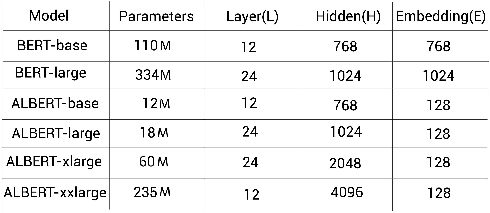

- [ALBERT](#albert)
  - [Reduce the number of params](#reduce-the-number-of-params)
  - [Training ALBERT model](#training-albert-model)
    - [Sentence order prediction](#sentence-order-prediction)
  - [Compare ALBERT with BERT](#compare-albert-with-bert)
- [RoBERTa](#roberta)
- [ELECTRA](#electra)
  - [Understand the replaced token detection task](#understand-the-replaced-token-detection-task)
- [SpanBERT](#spanbert)
- [Reference](#reference)
# ALBERT
## Reduce the number of params
**ALBERT** is basically **A Lite version of BERT**. It uses two following techniques to minimize training time by reducing the number of parameters 
- **Cross-layer parameter sharing**

Instead of learning the parameters of all the encoder layers, we only learn the parameters of the first
encoder layer, and then we just share the parameters of the first encoder layer with all the other encoder layers

We have several options for performing this technique: **Shared attention, shared feedforward network, all-shared(default)** - only share the parameters of multi-head attention, feedforward network and all sub-layers of first encoder layer respectively.
- Factorized embedding parameterization

We set the size of the WordPiece embedding to the same as the hidden layer embedding size because we directly project the one-hot-encoded vectors of the vocabulary to the hidden space. However, this increases the number of parameters to learn. With factorization, instead of directly projecting the one-hot-encoded vectors of vocabulary to the hidden space (V x H), first, we project one-hot-encoded vectors to low-dimensional embedding space (V x E), and then we project this low-dimensional
embedding to hidden space (E x H). That is, instead of projecting V x H directly, we factorize this step into V x E and E x H. Then, the number of parameters is VxE + ExH = E(V+H), not VxH.
## Training ALBERT model 
Similar to BERT, the ALBERT model is pre-trained using the English Wikipedia and Toronto BookCorpus datasets. We learned that BERT is pre-trained using the masked
language modeling (MLM) and next sentence prediction (NSP) tasks. Similarly, the ALBERT model is pre-trained using the MLM task but instead of using the NSP task, ALBERT uses a new task called **sentence order prediction (SOP)**. But why not use the NSP task?

The researchers of ALBERT pointed out that pre-training with the **NSP task is not really useful and it is not a difficult task to perform compared to the MLM task**. Also, the NSP task combines both topic prediction and coherence prediction into a single task. To alleviate this, researchers introduced the SOP task. **SOP is based on inter-sentence coherence and not on topic prediction**.

### Sentence order prediction 
SOP is basically a classification task where the goal of our model is to classify whether the sentence pair belongs to a positive class (sentence order not swapped) or a
negative class (sentence order swapped). 

We can create a dataset for a SOP task using any monolingual corpus. Say we have a couple of documents. We simply take two consecutive sentences from a document and label them as positive. Next, we swap the sentences and label them as negative.
## Compare ALBERT with BERT 
**Model zise** 

**Performance**

The ALBERT-xxlarge model has significantly outperformed both BERT-base and BERT-large on several language benchmark datasets, including SQuAD1.1, SQuAD2.0, MNLI SST-2, and RACE
# RoBERTa 
RoBERTa, which stands for **Robustly optimized BERT pre-training approach**, is essentially BERT with the following changes in pre-training
- Use dynamic masking instead of static masking in the MLM task.
- **Remove the NSP task and train using only the MLM task**: Researchers observed that the NSP task is not really useful for pre-training the BERT model and so they pre-trained the RoBERTa only with the MLM task
- **Train with more data**: RoBERTa model is pre-trained using *five datasets, instead of two datasets* and the sum of the total size of these five datasets is *160 GB, instead of 16 GB* as in BERT.
- **Train with a large batch size**: Training with a larger batch size increases the speed and performance of
the model
- **Use byte-level BPE (BBPE) as a tokenizer, not WordPiece**: We also note that BERT uses a vocabulary size of 30,000 tokens but
RoBERTa uses a vocabulary size of 50,000 tokens
# ELECTRA 
**ELECTRA (Efficiently Learning an Encoder that Classifies Token Replacements Accurately)** works similar to BERT, except that Instead of using the MLM task as a pre-training objective, ELECTRA is pre-trained using a task called **replaced token detection**.

Okay, but why use the replaced token detection task instead of the MLM task? One of the problems with the MLM task is that it uses the [MASK] token during pre-training but the [MASK] token will not be present during fine-tuning on downstream tasks. This causes a **mismatch between pre-training and fine-tuning**

One of the advantages of ELECTRA compared to BERT is that in BERT, we use MLM as a training objective where we mask only 15% of the tokens, so the training signal to the
model is only those 15% of the tokens since it predicts only those masked tokens. But **in ELECTRA, the training signal is all the tokens** since here, the model classifies whether all the given tokens are original or replaced

## Understand the replaced token detection task
The replaced token detection task is very similar to MLM but instead of masking a token with the [MASK] token, here we replace a token with a different token using Masked Language Model (called generator) and train the model to classify whether the given tokens are actual or replaced tokens (called discriminator).

The discriminator is basically our ELECTRA model. After training, we can remove the generator and use the discriminator as the ELECTRA model

Generator and discriminator of ELECTRA 

Generator of ELECTRA 

Discriminator of ELECTRA 

# SpanBERT
# Reference 
- Getting started with google BERT 