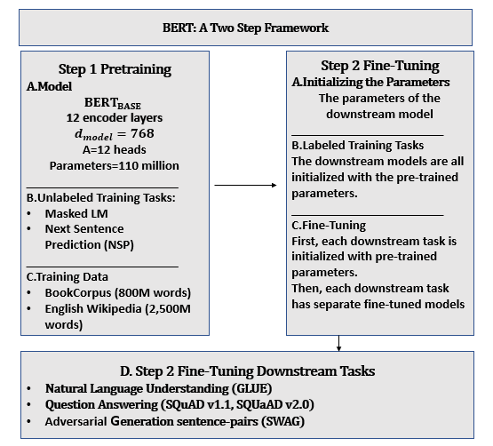
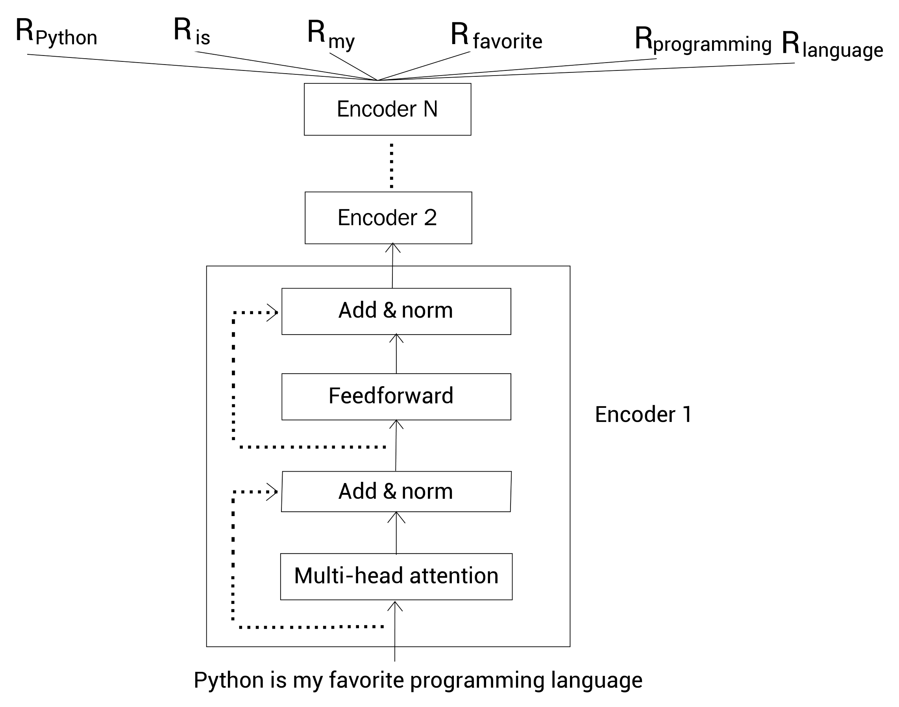
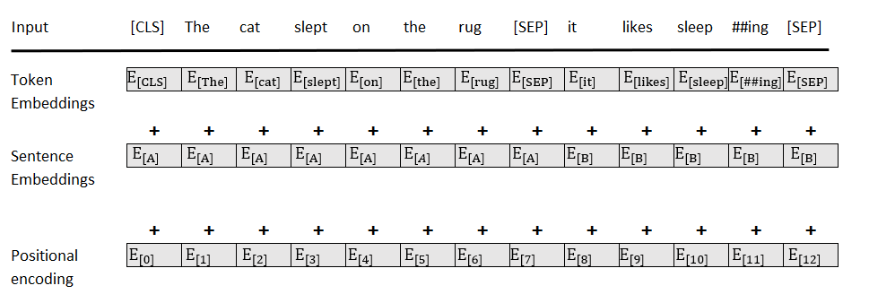

- [Transformer model architecture](#transformer-model-architecture)
  - [Components (building blocks)](#components-building-blocks)
    - [Embedding](#embedding)
    - [Positional encoding](#positional-encoding)
    - [Multi-head attention](#multi-head-attention)
    - [Masked multi-head attention](#masked-multi-head-attention)
    - [Residual connections](#residual-connections)
- [Bert](#bert)
  - [Model Architecture](#model-architecture)
  - [Tasks](#tasks)
    - [Masked language model](#masked-language-model)
    - [Next sentence prediction](#next-sentence-prediction)
  - [Subword tokenization algorithms](#subword-tokenization-algorithms)
    - [Byte pair encoding (BPE)](#byte-pair-encoding-bpe)
    - [Byte-level byte pair encoding (BBPE)](#byte-level-byte-pair-encoding-bbpe)
    - [WordPiece](#wordpiece)
  - [Summarization](#summarization)
  - [Fine-tuning BERT](#fine-tuning-bert)
- [Reference](#reference)
# Transformer model architecture 

It is a encoder-decoder architecture which includes a N-layer encoder stack on the left and a N-layer decoder stack on the right.

The creative aspect of transformer architecture is attention mechanism which replaces recurrence (RNN, LSTM).
## Components (building blocks)

### Embedding 
Embedding sub-layer converts input tokens to vectors of dimention $d_{\text model}$ using learned embeddings.
### Positional encoding 
It helps to provide additional information about words' position in sentences.
### Multi-head attention 
Multi-head attention is attention trained in parrallel that makes the training process faster.

Refer to **./Attention.md** file to know more about attention.
### Masked multi-head attention 
A masked multi-head attention only attends to positions up to and including the current position. The future words are hidden from Transformer, and this force it to learn how to predict.
### Residual connections 
LayerNorm(x + subLayer(x))
# Bert

## Model Architecture

BERT (**Bidirectional Encoder Representation from Transformer**) adds a new piece to the transfomer's building blocks: a bidirectional multi-head attention sub-layer. 

BERT only uses the blocks of the encoders of transformer in a novel way, and dosen't use the decoder stack. And hence, It dosen't have masked multi-head attention sub-layers. Bert states that a masked multi-head attention layer that masks the rest of sequence impedes the attention process.

For example, take the following sentence: **The cat sat on it because it is a nice rug**. If we have just reached the word **"it"**, the input of encoder could be: **The cat sat on it \<masked sequence>**. However, the model can not learn much this way. To know what **"it"** refers to, we need to see the whole sentence to reach the word **"rug"** and figure out that **"it"** was the rug. Therefore, The authors of BERT came up with bidirectional attention, letting an attention head attend to all of the words both from left to right and right to left.

## Tasks
### Masked language model 
Unlike masked attention in decoder which masks the rest of sentence, BERT randomly mask 15% of the tokens in the sentence. Now, for these of 15% tokens, we do the following:
- For 80% of the time, we replace the token (actual word) with the *[MASK]* token. For example: **[ [CLS], Paris, is, a beautiful, [MASK], [SEP], I, love, Paris, [SEP] ]**

- For 10% of the time, we replace the token (actual word) with a random token (random word). For example: **[ [CLS], Paris, is, a beautiful, love, [SEP], I, love, Paris, [SEP] ]**

- For 10% of the time, we don't make any changes. For example: **[ [CLS], Paris, is, a beautiful, city, [SEP], I, love, Paris, [SEP] ]**

This approach avoids overfitting and forces the model to train efficiently.

### Next sentence prediction
Two new tokens were added to sentences. 
- [CLS] is a binary classification token added to the beginning of the first sequence to predict if the second sequence follows the first sequence. A positive sample is usually a pair of consecutive sentences taken from a dataset. A negative sample is created using sequences from different documents.
- [SEP] is a separation token that signals the end of a sequence.

This approach requires additional encoding information to distinguish sequence A from B

## Subword tokenization algorithms 
Sub-word tokenization is popularly used in many state-of-the-art natural language model, including BERT, GPT-3. It is very effective in handling OOV words.
### Byte pair encoding (BPE)
**Algos** 
1. Extract the words from the given dataset along with their count.
2. Define the vocabulary size.
3. Split the words into a character sequence.
4. Add all the unique characters in our character sequence to the vocabulary.
5. Select and merge the symbol pair that has a high frequency.
6. Repeat step 5 until the vocabulary size is reached.

**Tokenizing with BPE**

For example, we had sub-word vocabulary produced by BPE algos as following: *vocabulary = {a,b,c,e,l,m,n,o,s,t,u,st,me,men}*

Now, let's see how this vocabulary can be used. Let's suppose our input text consists of only one word – *mean* . Now we check whether the word *mean* is present in our vocabulary. We can observe that it is not present in the vocabulary. So we split the word *mean* into subwords *[ me , an ]*. Now, we check whether the subwords are present in the vocabulary. We can observe that the subword *me* is present in the vocabulary, but the subword *an* is not
present in our vocabulary. Therefore, we split the subword an , so now our subwords consist of [ me , a , n ]. Now we check whether the characters *a* and *n* are present in our
vocabulary. Since they are present in our vocabulary, our final tokens will be as follows: *tokens = [me,a,n]*

### Byte-level byte pair encoding (BBPE)
**How it works** 

BBPE works very similar to BPE, But It uses byte-level sequence instead of character-level. 

For example, with *best* word, in BPE, we split it into sequence of character: **b e s t**. But in BBPE, we use byte representation of character: **62, 65, 73, 74**.

**Why we use BBPE**

BBPE will be very useful in multilingual setting. It is very effective in handling OOV words and It is great at sharing vocabulary in across multiple languages. 
### WordPiece

WordPiece works similar to BPE, with minor difference. It merges symbol pair that has a high likelihood of the language model instead of high frequency.

**Algos** 

1. Extract the words from the given dataset along with their count.
2. Define the vocabulary size.
3. Split the words into a character sequence.
4. Add all the unique characters in our character sequence to the vocabulary.
5. Build the language model on the given dataset (training set).
6. Select and merge the symbol pair that has the maximum likelihood of the language model trained on the training set.
7. Repeat step 6 until the vocabulary size is reached.
## Summarization
- A sequence of words is broken down into **WordPiece** (a sub-word tokenization method) tokens.
- A [MASK] token will randomly replace the initial word tokens for masked language modeling training.
- A [CLS] classification token is inserted at the beginning of a sequence for classification purposes.
- A [SEP] token separates two sentences (segments, phrases) for NSP training.
- Sentence embedding is added to token embedding, so that sentence A has a different sentence embedding value than sentence B.
- Positional encoding is learned. The sine-cosine positional encoding method of the original Transformer is not applied.
## Fine-tuning BERT
Fine-tuning can be broken down into 2 sub-steps:
- Initializing the downstream model chosen with the trained parameters of the pretrained BERT model
- Fine-tuning the parameters for specific downstream tasks such as Recognizing Textual Entailment (RTE), Question Answering ( SQuAD v1.1 , SQuAD v2.0 ), and Situations With Adversarial Generations (SWAG)
# Reference 
- Transformer for NLP book
- Getting started with Google BERT
- [A comprehensive guide to attention mechanism in deep learing for everyone.](https://www.analyticsvidhya.com/blog/2019/11/comprehensive-guide-attention-mechanism-deep-learning/#h2_1)