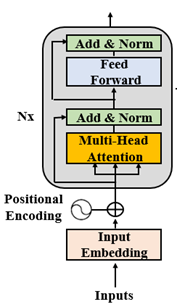

- [Transformer model architecture](#transformer-model-architecture)
  - [Components (building blocks)](#components-building-blocks)
    - [Embedding](#embedding)
    - [Positional encoding](#positional-encoding)
    - [Multi-head attention](#multi-head-attention)
    - [Masked multi-head attention](#masked-multi-head-attention)
    - [Residual connections](#residual-connections)
- [Bert](#bert)
  - [Model Architecture](#model-architecture)
  - [Tasks](#tasks)
    - [Masked language model](#masked-language-model)
    - [Next sentence prediction](#next-sentence-prediction)
    - [Summarization](#summarization)
  - [Fine-tuning BERT](#fine-tuning-bert)
- [Reference](#reference)
# Transformer model architecture 

It is a encoder-decoder architecture which includes a N-layer encoder stack on the left and a N-layer decoder stack on the right.

The creative aspect of transformer architecture is attention mechanism which replaces recurrence (RNN, LSTM).
## Components (building blocks)

### Embedding 
Embedding sub-layer converts input tokens to vectors of dimention $d_{\text model}$ using learned embeddings.
### Positional encoding 
It helps to provide additional information about words' position in sentences.
### Multi-head attention 
Multi-head attention is attention trained in parrallel that makes the training process faster.

Refer to **./Attention.md** file to know more about attention.
### Masked multi-head attention 
A masked multi-head attention only attends to positions up to and including the current position. The future words are hidden from Transformer, and this force it to learn how to predict.
### Residual connections 
LayerNorm(x + subLayer(x))
# Bert

## Model Architecture

BERT (**Bidirectional Encoder Representation from Transformer**) adds a new piece to the transfomer's building blocks: a bidirectional multi-head attention sub-layer. 

BERT only uses the blocks of the encoders of transformer in a novel way, and dosen't use the decoder stack. And hence, It dosen't have masked multi-head attention sub-layers. Bert states that a masked multi-head attention layer that masks the rest of sequence impedes the attention process.

For example, take the following sentence: **The cat sat on it because it is a nice rug**. If we have just reached the word **"it"**, the input of encoder could be: **The cat sat on it \<masked sequence>**. However, the model can not learn much this way. To know what **"it"** refers to, we need to see the whole sentence to reach the word **"rug"** and figure out that **"it"** was the rug. Therefore, The authors of BERT came up with bidirectional attention, letting an attention head attend to all of the words both from left to right and right to left.

## Tasks
### Masked language model 
Unlike masked attention in decoder which masks the rest of sentence, Bert masks a random word of the sentence and try to predict it.

But which stratergy Bert use for masking. It splits tranining data into 3 parts:
- Not masking a single token on 10% of dataset. For example: **The cat sat on it [because] it is a nice rug.**

- Replacing the token with a random token on 10% of dataset. For example: **The cat sat on it [often] it is a nice rug.**

- Replace a token by a **[MASK]** token on 80% of dataset. For example: **The cat sat on it [MASK] it is a nice rug.**

This approach avoids overfitting and forces the model to train efficiently.

### Next sentence prediction
Two new tokens were added to sentences. 
- [CLS] is a binary classification token added to the beginning of the first sequence to predict if the second sequence follows the first sequence. A positive sample is usually a pair of consecutive sentences taken from a dataset. A negative sample is created using sequences from different documents.
- [SEP] is a separation token that signals the end of a sequence.

This approach requires additional encoding information to distinguish sequence A from B

### Summarization
- A sequence of words is broken down into **WordPiece** (a sub-word tokenization method) tokens.
- A [MASK] token will randomly replace the initial word tokens for masked language modeling training.
- A [CLS] classification token is inserted at the beginning of a sequence for classification purposes.
- A [SEP] token separates two sentences (segments, phrases) for NSP training.
- Sentence embedding is added to token embedding, so that sentence A has a different sentence embedding value than sentence B.
- Positional encoding is learned. The sine-cosine positional encoding method of the original Transformer is not applied.
## Fine-tuning BERT
Fine-tuning can be broken down into 2 sub-steps:
- Initializing the downstream model chosen with the trained parameters of the pretrained BERT model
- Fine-tuning the parameters for specific downstream tasks such as Recognizing Textual Entailment (RTE), Question Answering ( SQuAD v1.1 , SQuAD v2.0 ), and Situations With Adversarial Generations (SWAG)
# Reference 
- Transformer for NLP book
- [A comprehensive guide to attention mechanism in deep learing for everyone.](https://www.analyticsvidhya.com/blog/2019/11/comprehensive-guide-attention-mechanism-deep-learning/#h2_1)