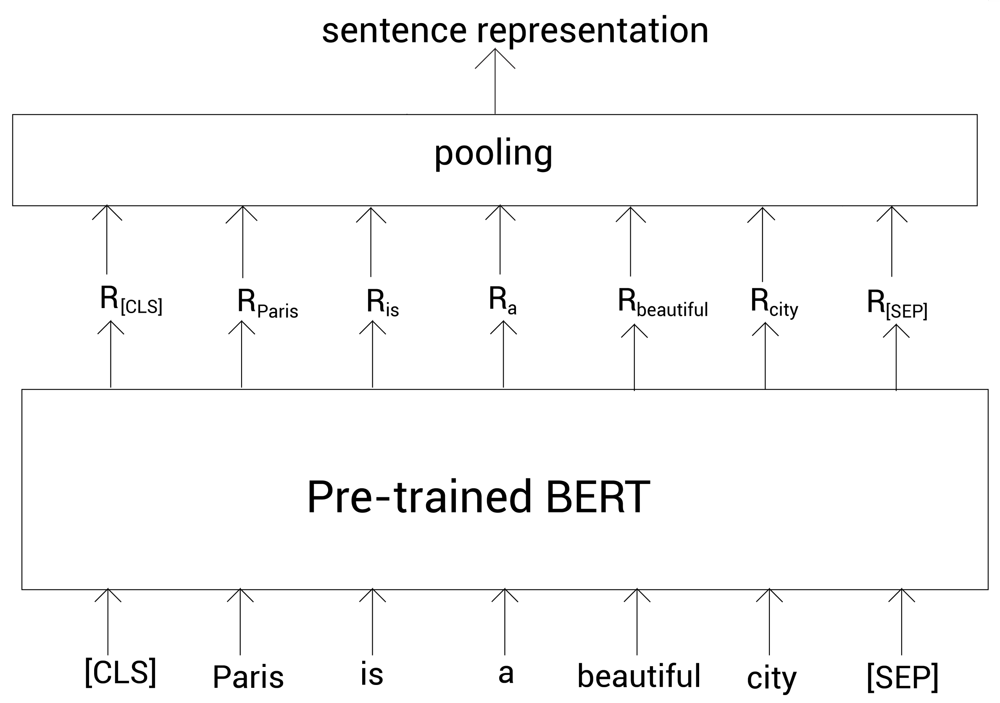
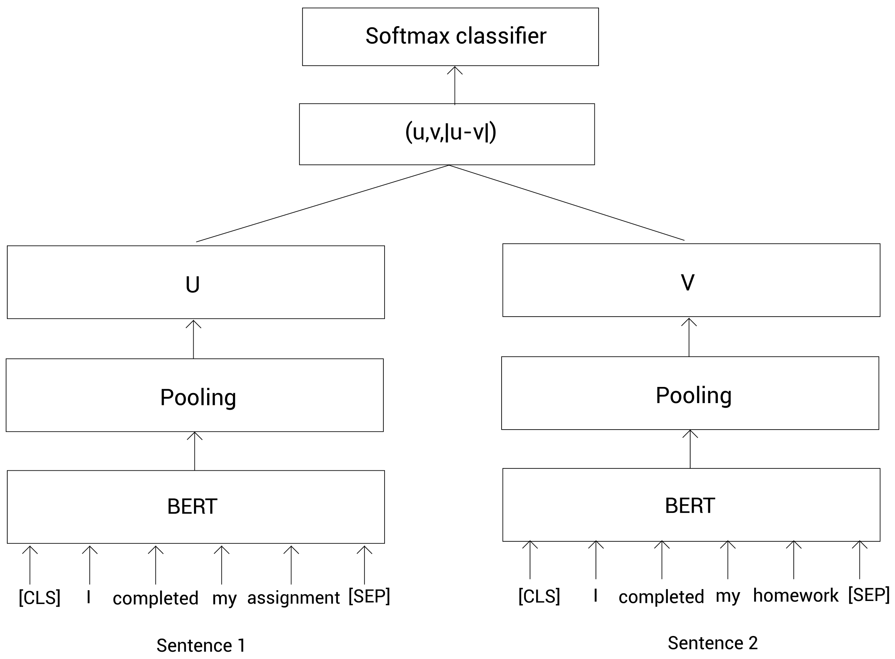
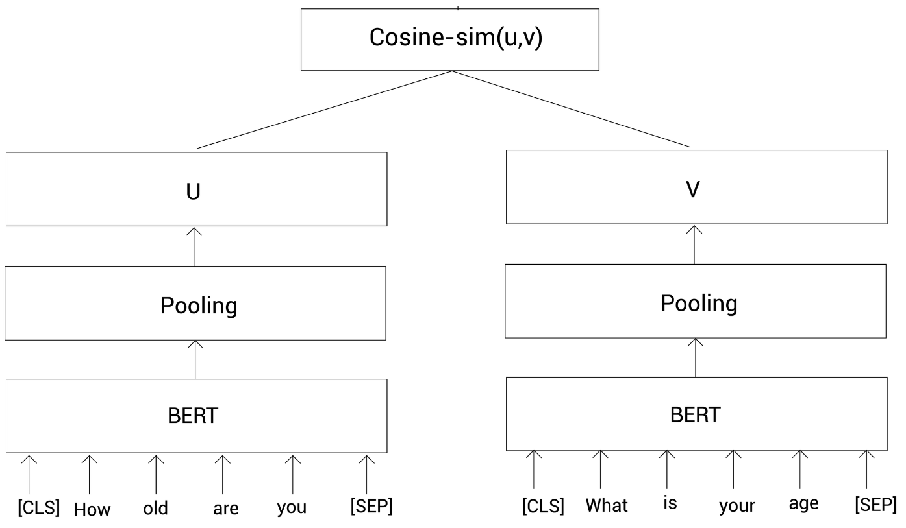
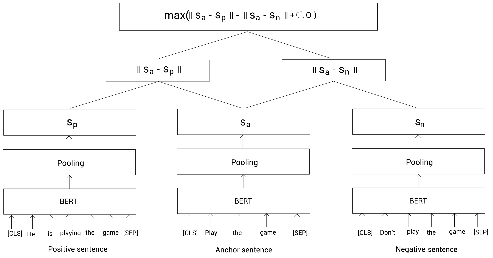

- [Introduction](#introduction)
- [Understand Sentence-BERT](#understand-sentence-bert)
  - [Siamese network](#siamese-network)
    - [Sentence BERT for a sentence pair classification task](#sentence-bert-for-a-sentence-pair-classification-task)
    - [Sentence BERT for a sentence pair regression task](#sentence-bert-for-a-sentence-pair-regression-task)
  - [Triplet network](#triplet-network)
# Introduction 
**Sentence-BERT** was introduced by the **Ubiquitous Knowledge Processing Lab (UKP-TUDA)**. As the name suggests Sentence-BERT is used for obtaining fixed-length sentence representations

**Applications**: Sentence is popularly used in tasks such as sentence pair classification, computing the similarity between two sentences and so on. 

**Why need it?**

Why we don't use the representation of *CLS* token as sentence representation?

The problem with this is that sentence representaion will not be accurate, especially if we are using the pre-trained BERT model directly without fine-tuning it. So, instead of using the representaion of *CLS* token as the sentence representaion, we can use pooling. While average pooling holds the meaning of all words, max pooling holds the meaning of important words.

# Understand Sentence-BERT
Note that we don't train Sentence-BERT from scratch. In Sentence-BERT, we take the pre-trained BERT model (or its variants) and fine-tune it for obtaining the sentence
representation.

For fine-tuning the pre-trained BERT, Sentence-BERT uses a **Siamese network** architecture for tasks that involves a sentence pair as input and a **triple network architecture** for the triple loss objective function.

## Siamese network
### Sentence BERT for a sentence pair classification task
Model will predicts whether the sentence pairs are similar or dissimilar (a binary classification task)

First we feed the sentence pair to the pre-trained BERT models and obtain the sentence representation through pooling, then we concatenate the representation of the sentence pair and multiply it by the weights, W , and
feed the result to the softmax function.

Then we train by maximizing the cross-entropy loss and updating the weight.

### Sentence BERT for a sentence pair regression task 
Model will predict  the similariy scores of the sentence pairs. 

We train the network by minimizing mean-squared loss and updating the weight.

Model architecture as follow: 

## Triplet network
Suppose we have three sentences – an anchor sentence, a positive sentence (entailment), and a negative sentence (contradiction), as follows
- **Anchor sentence**: Play the game
- **Positive sentence**: He is playing the game
- **Negative sentence**: Don't play the game

Our task is to compute a representation such that the similarity between the anchor and positive sentences should be high and the similarity between the anchor and negative sentences should be low.

Model would work as follow. First, we tokenize and feed the anchor, positive, and negative sentences to the three pre- trained BERT models, and then obtain the representation of each of the sentences through pooling. 

Next, we train our network to minimize the following triplet objective function: $\text{max}(||s_a - s_p|| - ||s_a - s_n|| + \epsilon, 0)$. We use euclidean distance as the distance metric. $\epsilon$ denotes the margin; it is used to ensure that the positive sentence representation is at least $\epsilon$ closer to the anchor sentence than the negative sentence.

