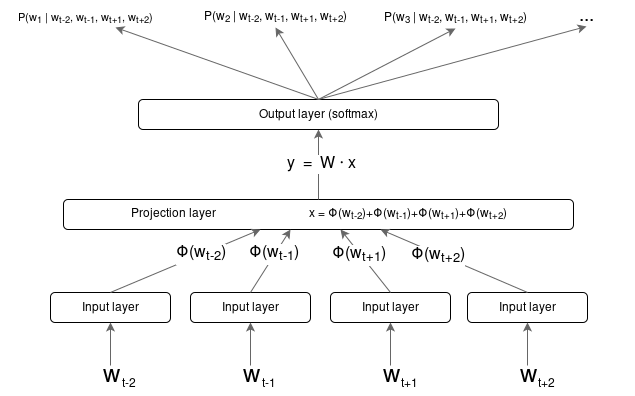
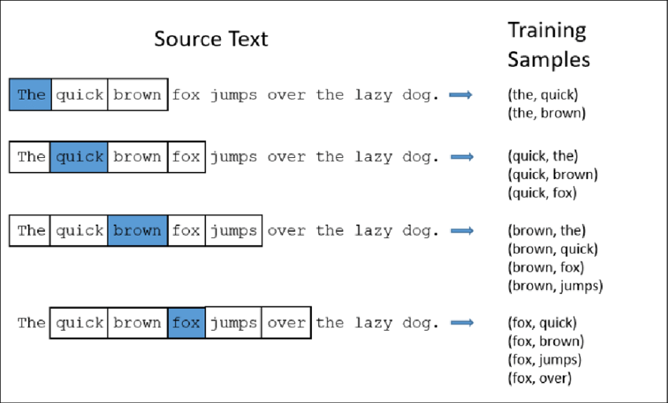
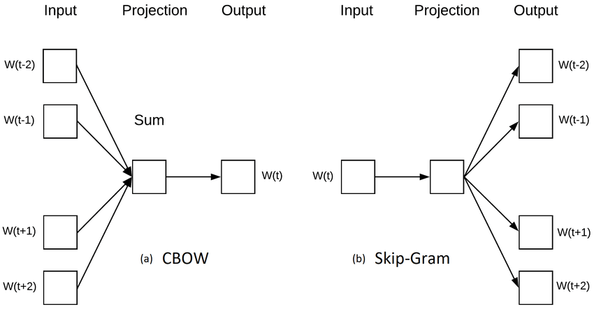

Table of contents
- [Overview](#overview)
- [Visualizing embeddings](#visualizing-embeddings)
- [TF-IDF](#tf-idf)
  - [Algos](#algos)
  - [Pros and cons](#pros-and-cons)
  - [References](#references)
- [Word2vec](#word2vec)
  - [Best practices](#best-practices)
    - [Pay attention to bias](#pay-attention-to-bias)
    - [Deployment](#deployment)
    - [Representations for larger units of text](#representations-for-larger-units-of-text)
    - [Handle OOV word](#handle-oov-word)
    - [Universal text representation](#universal-text-representation)
    - [Others](#others)
  - [Algos](#algos-1)
    - [CBOW](#cbow)
    - [Skipgram](#skipgram)
  - [References](#references-1)
- [Glove](#glove)
- [Fasttext](#fasttext)
- [Transfomer](#transfomer)
# Overview
This part explains all modern word embedding algorithms

Each part trys to answer the following questions:
- How it works? 
- What is pros and cons/ applications/ problems/ Best practices?

# Visualizing embeddings

# TF-IDF 
## Algos
**Tf-idf** is a numerical statistic that is intended to reflect how important a word is to a document in a collection or corpus. The vectorization process is similar to **Bag-of-word** technique.Alternatively, the value corresponding to the word is assigned a **tf-idf** value instead of the number of the occurrence of word. The tf-idf value is obtained by multiplying the TF and IDF values.

**TF(Term frequency)** measures how often a word occurs in a document. Since different documents in the corpus may be of different length, a term may occur more often in a longer document as compared to a shorter ducument. To normalize these counts, we divide the number of occurrences by the length of document. TF of a term t in a document d is defined as: 

**IDF (inverse document frequency)** measures the importance of a term across a corpus. In computing TF, all term are given equal importance (weightage). It's a well-known fact that stop words like is,am, a, an ,the,... are not important, even though they occur frequently. To account for such cases, IDF weighs down the terms that are very common across a corpus and weigh up rare terms. IDF of a term is calculated as following:

## Pros and cons 
Disadvantage 
- It still relies on lexical analysis and does not take into account things such as the co-occurrence of terms, semantics, the context associated with terms, and the position of a term in a document. It is dependent on the vocabulary size, like *CountVectorizer* , and will get really slow with large vocabulary sizes.
- The feature vectors are sparse and high-dimensional representations --> make them computationally inefficient.
- They cannot handle OOV words.
## References
- https://en.wikipedia.org/wiki/Tf%E2%80%93idf
- https://scikit-learn.org/stable/modules/feature_extraction.html#text-feature-extraction
- https://towardsdatascience.com/word-embedding-techniques-word2vec-and-tf-idf-explained-c5d02e34d08
# Word2vec 
## Best practices 

### Pay attention to bias

All text representations are inherently biased based on what they saw in training data. For example, an embedding model trained heavily on technology news or articles is likely to identify Apple as being closer to, say, Microsoft or Facebook than to an orange or pear. Understanding biases that may be present in learned embeddings and developing methods for addressing them is very important.

### Deployment

Unlike the basic vectorization approaches, pre-trained embeddings are generally large-sized files (several gigabytes), which may pose problems in certain deployment scenarios

One good hack is to use in-memory databases like Redis [28] with a cache on top of them to address scaling and latency issues. Load your embeddings into such databases and use the embeddings as if they’re available in RAM

### Representations for larger units of text

In most NLP applications, we seldom deal with atomic units of texts like words, we deal with sentences, paragraphs, or even full texts. So we need a way to represent larger units of texts.

The simple approach is to break the text into constituent words, take the embeddings for individual words, and combine them to form the representation for the text. There are various ways to combine them, The most popular being sum, average, ... but these may not capture many aspects of the text as a whole, such as ordering. Take, for example, sentences **dog bites man** and **man bites dog**. If we use above method (sum, average), Both sentences receive the same representation, but they obviously have different meanings. Suprisingly, they work well in practice.

There is an another approach called **Doc2vec** which allow us handle the above problem. Doc2vec is similar to word2vec in terms of its general architecture, except that, in addition to the word vector, it also learns a **paragraph vector** which represents for full paragraph.

### Handle OOV word

The simple approach that often work is to **exclude those words**. But if the overlap between corpus / infer vocabulary and embedding/ training vocabulary is less then 80%, we're unlikely to see good performance. 

Another way to deal with the OOV problem for word embedding is to **create vectors that are initialized randomly, where each component is between -0.25 to + 0.25, and continue to use these vector through the application we're building**. From experience, this can give us a jump of 1-2% in performance.

There are also other approaches that handle the OOV problem by modifying the training process by bringing in characters and other subword-level linguistic components. Let’s look at one such approach now. The key idea is that one can potentially handle the OOV problem by using subword information, such as morphological
properties (e.g., prefixes, suffixes, word endings, etc.), or by using character representations. **fastText**, from Facebook AI research, is one of the popular algorithms
that follows this approach. A word can be represented by its constituent character n-grams.  **Following a similar architecture to Word2vec, fastText learns embeddings for
words and character n-grams together and views a word’s embedding vector as an aggregation of its constituent character n-grams**. This makes it possible to generate
embeddings even for words that are not present in the vocabulary

### Universal text representation

In all text representation we've seen so far, **each word gets a fixed represention**. So with a word that has multiple meanings, Which meaning that it's embedding represent for? For example, the sentences “I went to a bank to withdraw money” and “I sat by the river bank and pondered about text representations” both use the word “bank.” However, they mean different things in each sentence.

In 2018, researcher came up with the idea of **contextual word representation**, which addresses this issue. It uses **language model** which predicts the next word based on the previous words. So why this help us to handle the above problem? For example, continuing with the above example, Language models try to predict the next word given "I went to a ..." and "money withdraw to ..." (Many modern neural network architecture capture the meaning of word in 2 directions - read from left to right and from right to left- such as bi-LSTM). So based on the context of words, language model known the exact meaning of the *bank* word. **The mechanism of word2vec is similar to language model, both are based on the context of word, except that it uses simple neural network architecture (2 layer).**

Neural architectures such as recurrent neural networks (RNNs) and transformers were used to develop large-scale models of language (ELMo, BERT), which
can be used as pre-trained models to get text representations. The key idea is to leverage “transfer learning”—that is, to learn embeddings on a generic task (like language modeling) on a massive corpus and then fine-tune learnings on task-specific data.

### Others 

Modeling language for a real-world application is more than capturing the information via word and sentence embeddings. We still need ways to encode specific
aspects of text, the relationships between sentences in it, and any other domain-and application-specific needs that may not be addressed by the embedding
representations themselves (yet!). For example, the task of sarcasm detection requires nuances that are not yet captured well by embedding techniques.

## Algos 
Word2vec trys to predict a word (w) given it's context (C). We can formulate it as P(w|C). 

We create train data by running a sliding window of size 2k+1 over the text corpus with k is window size. The center word in the window is the target, and k works on either side of the center word form the context. Then (X,Y) is equivalent to (Context word, target word).

How we can find the embedding of words? For every word w in corpus, we start by initializing a random vecto v_w. Then we pass training data (represented by v_w)  though a two-layer neural network. Then neural network updates parameter (v_w) using optimizer such as SGD, Adam to optimize loss function. And, finally, we have a learned embedding matrix.

There are 2 variations of word2vec: **CBOW** and **Skipgram**
### CBOW 
CBOW predicts the center word given context word in which the center word appears.

Create training data

Neural network architecture

### Skipgram  
Skipgram predicts the context words from the center words.

Create training data

Neural network architecture

## References 
- https://en.wikipedia.org/wiki/Word2vec#Extensions
- Practical NLP book
# Glove 
# Fasttext 
# Transfomer